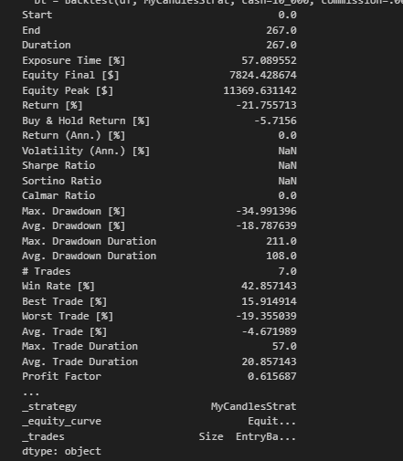

# Btc-Eth Neural Network Trading

## Overview
This project implements a neural network model for predicting cryptocurrency prices, specifically Bitcoin (BTC) and Ethereum (ETH). The model aims to enhance trading strategies by providing accurate price predictions.

## Features
- **Data Preprocessing**: Historical market data is cleaned and prepared for analysis.
- **Neural Network Model**: Built using TensorFlow and Keras to predict price movements.
- **Backtesting**: Strategies are validated against historical data to assess performance.

  ## Results
## Screenshot

[visualization](Charts.png)


## Installation
To run this project locally, ensure you have Python installed along with the following libraries:
```bash
pip install numpy pandas tensorflow keras matplotlib xgboost backtesting


